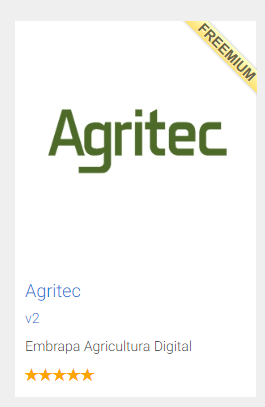
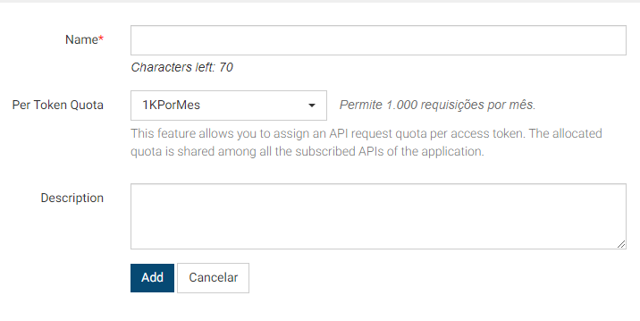

# Instruções para Obter as Chaves da API Zarc

Este repositório contém um cliente para interagir com a API da Zarc. Para usar a API, você precisará obter duas chaves: `KEY`, `SECRET_KEY` e `USERNAME`, `PASSWORD`. Siga as etapas abaixo para obter suas chaves de acesso.

Documentação sobre a API [Clique aqui](https://www.agroapi.cnptia.embrapa.br/portal/assets/docs/agritec.pdf)

## Diretório do projeto

agritec_operator/\
│ \
├── .venv/\
│\
├── infra/\
│   ├── __pycache__/\
│   │\
│   ├── data_prep.py\
│   └── queryService.py\
│\
├── README.md\
├── .env\
├── .gitignore\
└── exemplo.ipynb
## Passo 0: Prepare um ambiente

1. Crie e ative um ambiente de desenvolvimento

```bash
python -m venv .venv

source .venv/bin/activate
```

2. Instale as dependências

```
python -m pip install -r requirements.txt
```

## Passo 1: Criar uma Conta

1. Acesse o site da [AgroAPI Store](https://www.agroapi.cnptia.embrapa.br/store/).
2. Crie uma conta.

## Passo 2: Solicitar Acesso à API

1. Procure pela API **Agritec**

    
2. Na aba **Applications**, selecione `New application...`

    

3. Seleciona a opção `1KPorMes` no campo **Per Token Quota**

    

## Passo 3: Obter as Chaves `KEY` e `SECRET_KEY`

1. No canto esquerdo clique na aba **Applications** e selecione a aplicação que acabou de criar:
2. Assim, selecione a aba `Production Keys`;
3. Clique em **Generate keys**
4. Salve as credenciais `Consumer Key` e `Consumer Secret`

## Passo 4: Configurar seu Ambiente

Para usar as chaves na sua aplicação, é recomendável armazená-las em um arquivo `.env` para manter a segurança. Aqui está um exemplo de como fazer isso:

1. Crie um arquivo chamado `.env` no diretório (Igual como está no tópico diretório do projeto)
2. Adicione as seguintes linhas ao arquivo `.env`:

   ```plaintext
    KEY='sua consumer_key'
    SECRET_KEY='sua consumer_secret'
    LOGIN_USERNAME='username'
    PASSWORD='password'
